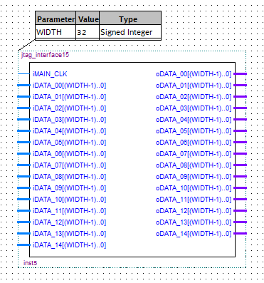
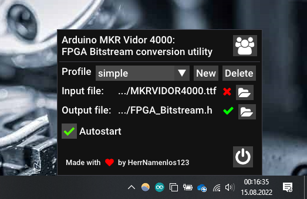

<h2 align="center">All you will ever need for FPGA development</h2>

This Arduino library takes care of uploading your custom FPGA bitstream, as well as communicating with your FPGA program at runtime.

## What is the JTAG Interface ❓

The JTAG_Interface is a project to help any new developer using the Arduino MKR Vidor 4000 to establish a communication between the CPU and the FPGA. When using a default library like `VidorGraphics` or `VidorPeripherals` the FPGA magically reacts to any command you give it in the Arduino IDE. But as soon as you start to create your own bitstreams using Intel Quartus, you will quickly realize that there is no obvious way to exchange data or commands between the CPU and the FPGA anymore.

Well, this has changed now! May I introduce: The JTAG_Interface!

<table align="right">
    <thead>
        <tr>
            <th>Default module:</th>
        </tr>
    </thead>
    <tbody>
        <tr>
            <td>
                
            </td>
        </tr>
    </tbody>
</table>

The module `jtag_interface` is the base module, but since it is not so easy to work with, there are versions with 3, 7, 15 and 31 I/O registers. If you are wondering, these numbers were chosen because the are the most memory efficient for a given case, any other number wastes address space.

Such a module only needs a clock (120 MHz `wCLK120`). Input registers on the left can be read from and output registers on the right can be written to. For any more information take a look at the example `simple`.

## How do I install it? 💾

Installing is now easier than ever, it is part of the official Arduino library manager! Just open the Arduino IDE, go to the library manager and search for `JTAG_Interface`. You know the rest.

## How does it work? 💡

The file [FPGA/projects/example_simple/jtag_memory.v](FPGA/projects/example_simple/jtag_memory.v) is the core of everything. Please read this file if you are interested in how it works, it is the central place for documentation.

For now, only one JTAG_Interface can be instanced in one FPGA program. (Only the first one is chosen for transaction). In the future it might be possible to use multiple instances and reference them using their ID, please let me know if you would be interested in this feature!

## Developing custom FPGA bistreams 🔨

When the example compiles and runs successfully, it is time to create your own bitstream.

This library folder also contains the example Intel Quartus project, so if you don't have one already you can open this one by navigating to your libraries folder. Your libraries location is by default `C:/Users/<USERNAME>/Documents/Arduino/libraries`).

Here you can see the example file: `FPGA/projects/example_simple/MyDesign.bdf`. You can continue development here or in `MKRVIDOR4000_top.v`.

You can set the bit width of all registers as a parameter of the module. Unfortunately this cannot be done with the number of registers, so there are different versions for you to choose from. If you need even more registers than are available, just copy `jtag_interface31.v`. You will quickly see the pattern, just continue it for as many registers as you need.

After that you still need symbol files, for that go to `File -> Create/Update -> Create Symbol files for current file`. Now you should see your module when you double-click empty space.

Now try compiling it by hitting the blue play button. When successful, the bitstream now needs to be converted, for this check out my ByteReverser project. It is a very small and fast utility, designed to keep your code flowing!

[https://github.com/HerrNamenlos123/bytereverse](https://github.com/HerrNamenlos123/bytereverse)

<table>
    <tbody>
        <tr>
            <td>
                
            </td>
            <td>
                
            </td>
        </tr>
    </tbody>
</table>

Create a profile that takes in the `output_files/MKRVIDOR4000.ttf` of your Quartus project and set the output to the `FPGA_Bitstream.h` in this libraries' `src` folder. You must overwrite the original one.

Well, there's not much more to say, just try playing around. If something is not working and you need help, refer to the last section.

## Radboud University Nijmegen🎓

This project is backed by the [Radboud Universiteit Nijmegen](https://www.ru.nl/en) in the Netherlands. The Radboud University's Department of AI offers a course in [Neuromorphic Engineering](https://en.wikipedia.org/wiki/Neuromorphic_engineering) and the decision fell onto the Arduino MKR Vidor 4000. As a result, students of the neuromorphic enginnering course now use this Arduino library to test FPGA implementations for simulating nervous systems.  
Thank you for the collaboration!

## Final notes 📃

This library was tested with Intel Quartus lite 21.1.1.850. If you need the old version for Quartus 18.1, it can be found in the releases.

## Support 💪

I do all of my projects in my free time and I do not get any money for that. I just like what I do, do it for myself and want to share it so that others can benefit too.

I like to drink beer and any support is greatly apprechiated :)

## Something's not working... 💩

In case something isn't working as expected or you need help in your project, don't hesitate to contact me at: <herrnamenlos123@gmail.com>. No need to be shy :)

Additionally, in case you find a bug or want to request a feature or similar, you can go to the [issues tab](https://github.com/HerrNamenlos123/JTAG_Interface/issues) and create one.

Now as that's out of the way, let's get coding and create something amazing!
