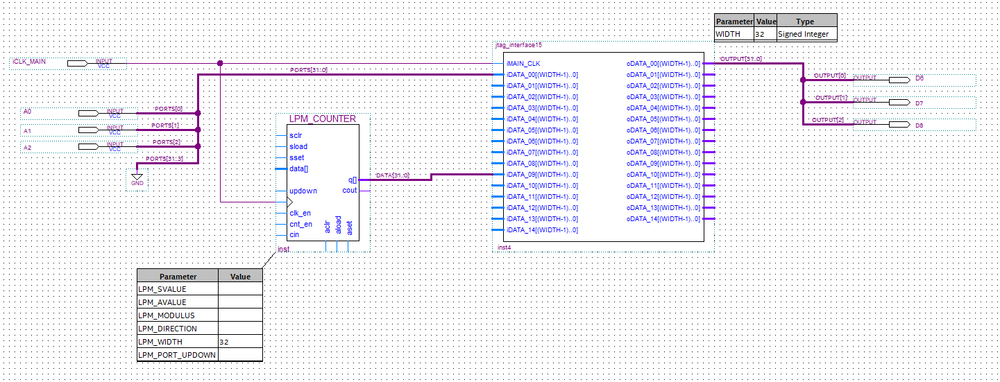

<h2 align="center">All you will ever need for FPGA development</h2>

This Arduino library takes care of uploading your custom FPGA bitstream, as well as communicating with your FPGA program at runtime.

## What is the JTAG Interface ❓

The JTAG_Interface is a project to help any new developer using the Arduino MKR Vidor 4000 to establish a communication between the CPU and the FPGA. When using a default library like `VidorGraphics` or `VidorPeripherals` the FPGA magically reacts to any command you give it in the Arduino IDE. But as soon as you start to create your own bitstreams using Intel Quartus, you will quickly realize that there is no obvious way to exchange data or commands between the CPU and the FPGA anymore.

Well, this has changed now! May I introduce: The JTAG_Interface!

<table align="right">
    <thead>
        <tr>
            <th>Default module:</th>
        </tr>
    </thead>
    <tbody>
        <tr>
            <td>
                
            </td>
        </tr>
    </tbody>
</table>

The module `jtag_interface` is the base module, but since it is not so easy to work with, there are versions with 3, 7, 15 and 31 I/O registers. If you are wondering, these numbers were chosen because the are the most memory efficient for a given case, any other number wastes address space.

Such a module only needs a clock (120 MHz `wCLK120`). Input registers on the left can be read from and output registers on the right can be written to. For any more information take a look at the example `simple`.

## How do I install it? 💾

Installing is now easier than ever, it is part of the official Arduino library manager! Just open the Arduino IDE, go to the library manager and search for `JTAG_Interface`. You know the rest.

## How does it work? 💡

The file [FPGA/projects/example_simple/jtag_memory.v](FPGA/projects/example_simple/jtag_memory.v) is the core of everything, while all other modules are wrapped around it. If you want to know how everything works, read this file. At the top there is a description of the internal workings and below it is the actual implementation.

As a short version, this protocol works like a shift register. The Altera Virtual JTAG instance is set up (which allows you to write either to an address register or a value register). Then when a transmission starts, an address is transmitted, whose bit width depends on your configuration, but it always contains the read index and the write index. After all those bits, the actual data is transmitted bit by bit, which basically shifts your write data in and shifts the read data back out to you. After the transmission is complete, the data you just wrote is latched to the corresponding output, so that it remains there and the entire output register updates in an instant. The same is for the input register, which is captured once when transmission starts. No need to care about signal changes while a transmission is happening. Reading and writing can happen at the same time, which makes it very efficient. When either index is the reserved one (-1), no corresponding action is done. When both reading and writing indices are -1, a 16-bit identifier is returned which tells your MCU how many registers there are so that initialization can fail until the configuration matches. This prevents bit width mismatches. 

## Developing custom FPGA bistreams 🔨

When the example compiles and runs successfully, it is time to create your own bitstream.

This library folder also contains the example Intel Quartus project, so if you don't have one already you can open this one by navigating to your libraries folder. Your libraries location is by default `C:/Users/<USERNAME>/Documents/Arduino/libraries`).

Here you can see the example file: `FPGA/projects/example_simple/MyDesign.bdf`. You can continue development here or in `MKRVIDOR4000_top.v`.

You can set the bit width of all registers as a parameter of the module. Unfortunately this cannot be done with the number of registers, so there are different versions for you to choose from. If you need even more registers than are available, just copy `jtag_interface31.v`. You will quickly see the pattern, just continue it for as many registers as you need.

After that you still need symbol files, for that go to `File -> Create/Update -> Create Symbol files for current file`. Now you should see your module when you double-click empty space.

Now try compiling it by hitting the blue play button. When successful, the bitstream now needs to be converted, for this check out my ByteReverser project. It is a very small and fast utility, designed to keep your code flowing!

<table>
    <tbody>
        <tr>
            <td>
                
            </td>
            <td>
                
            </td>
        </tr>
    </tbody>
</table>

Create a profile that takes in the `output_files/MKRVIDOR4000.ttf` of your Quartus project and set the output to the `FPGA_Bitstream.h` in this libraries' `src` folder. You must overwrite the original one.

Well, there's not much more to say, just try playing around. If something is not working and you need help, refer to the last section.

## Who is using this?🎓

This library is already successfully being used at a well-known university, but I want to get permission before I mention the name here. So keep an eye on this chapter in the close future :)

## Supporting 💪

I did all of this like most of my other projects in my free time and I do not get any money for that. I just like what I do, do it for myself and want to share it so that others can benefit too.

Exactly for this reason would it be even more amazing if you could find the motivation to buy me a coffee :)

## Final notes 📃

This library was tested with Intel Quartus lite 21.1.1.850. If you need the old version for Quartus 18.1, it can be found in the releases.

## Something's not working... 💩

In case something isn't working as expected or you need help in your project, don't hesitate to contact me at: <herrnamenlos123@gmail.com>. No need to be shy :)

Additionally, in case you find a bug or want to request a feature or similar, you can go to the [issues tab](https://github.com/HerrNamenlos123/JTAG_Interface/issues) and create one.

Now as that's out of the way, let's get coding and create something amazing!
